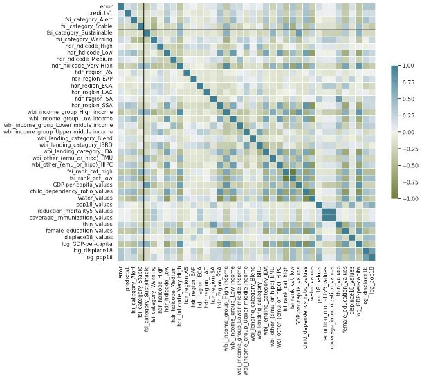

1/25/24, 12:50 AM Project Final 40 (4)1

**Predicting Conflict Escalation**

**STA130 Course Project**

**Group:** Yiwei Jang, Saeed Al Shrouf, David Kayadarma **Professor:** Scott Schwartz

**Project Overview**

Within this project, we aim to complete a thorough analysis of the transformer, xgboost, and ffnn models responsible for the prediction of conflict escalation in countries. We will be using data provided by UNICEF as well as the Fund for Peace's Fragile States Index. By taking different subsets of this data depending on different demographics and characteristics of countries, we aim to train our own regression model which would allow us to conclude how these demographics affect the performance of the three models identified above.

**Statistical Terminology**

- Bootstrapped Confidence Interval
  - This is a statistical method in which you resample the observed data with replacement to create multiple simulated datasets. By repeatedly drawing samples and estimating a statistic, you can deduct a certain range of values, quantifying the uncertainty around the true parameter, given a certain level of 'confidence' we have about the prediction.
- Hypothesis Testing
  - Within this statistical method, we make a prediction about a parameter of the population, after which we conduct testing to check whether or not this is an accurate inference and to what degree. To do this we use something called a P- Value, though beyond the fact that we calculate it and judge the accuracy of the prediction based on this table, there is no need to go into further depth on it.

**Library Imports and Data Loading**

**Python Library Imports**

In [1]: **import** pandas **as** pd![ref1]

**import** numpy **as** np

**Confusion Matrix Display**

In [2]: **from** sklearn.metrics **import** ConfusionMatrixDisplay![ref2]

**Machine Learning Models and Metrics**

In [3]: **from** sklearn **import** tree, model\_selection![ref3]

**from** sklearn **import** metrics

**Data Visualization**

In [4]: **import** seaborn **as** sns![ref4]

**import** plotly.graph\_objects **as** go **import** plotly.io **as** pio

**import** plotly.express **as** px

**Statistical Modeling**

In [5]: **import** statsmodels.formula.api **as** smf ![ref5]**import** statsmodels.api **as** sm

**Pandas Configuration**

In [6]: pd**.**options**.**mode**.**chained\_assignment **=** **None![ref2]**

**Data Importation**

In [7]: cid **=** pd**.**read\_csv('country\_indicators.csv')![ref6]

tp **=** pd**.**read\_csv('test\_predictions.csv')

**Geographical Chloropleth Visualisation of Conflict Escalation Probability Across Models**

In [8]: df **=** tp**.**merge(cid,left\_on**=**'iso3', right\_on**=**'iso3', how**=**'inner')

fig **=** []

**for** model,colors **in** zip(['y\_pred\_proba\_transformer', 'y\_pred\_proba\_ffnn', 'y\_pred\_p                         ['Reds', 'Blues', 'Greens']):

`    `fig **+=** [go**.**Figure(data **=** go**.**Choropleth(

`               `locations**=**df['iso3'], text**=**df['iso3'], z**=**df[model], 

`               `colorscale **=** colors, autocolorscale**=False**, reversescale**=False**, marke                marker\_line\_width**=**0.5, colorbar\_tickprefix**=**'', colorbar\_title**=**model) fig[0]**.**show()

fig[1]**.**show() fig[2]**.**show()

**Create the Prediciton Probability "Error" results for xgboost**

In [9]: tp['xgboost\_probability\_prediction\_error'] **=** np**.**abs(tp['y\_true\_xgboost']**.**astype(flo tp![ref1][['y\_true\_xgboost','y\_pred\_proba\_xgboost','xgboost\_probability\_prediction\_error']

Out[9]: **y\_true\_xgboost y\_pred\_proba\_xgboost xgboost\_probability\_prediction\_error**

|**0**|False|0\.066500|0\.066500|
| - | - | - | - |
|**1**|False|0\.099643|0\.099643|
|**2**|True|0\.704086|0\.295914|
|**3**|True|0\.638444|0\.361556|
|**4**|False|0\.608380|0\.608380|
|**...**|...|...|...|
|**359**|False|0\.079453|0\.079453|
|**360**|False|0\.060189|0\.060189|
|**361**|True|0\.697625|0\.302375|
|**362**|False|0\.729246|0\.729246|
|**363**|False|0\.591722|0\.591722|

364 rows × 3 columns

**Create the Prediciton Probability "Error" results for ffnn**

In [10]: tp['ffnn\_probability\_prediction\_error'] **=** np**.**abs(tp['y\_true\_ffnn']**.**astype(float) **-** ![ref3]

tp[['y\_true\_ffnn','y\_pred\_proba\_ffnn','ffnn\_probability\_prediction\_error']] Out[10]: **y\_true\_ffnn y\_pred\_proba\_ffnn ffnn\_probability\_prediction\_error**

|**0**|False|0\.409958|0\.409958|
| - | - | - | - |
|**1**|False|0\.406696|0\.406696|
|**2**|False|0\.545236|0\.545236|
|**3**|False|0\.534560|0\.534560|
|**4**|True|0\.538583|0\.461417|
|**...**|...|...|...|
|**359**|False|0\.291874|0\.291874|
|**360**|False|0\.300321|0\.300321|
|**361**|False|0\.335496|0\.335496|
|**362**|False|0\.324000|0\.324000|
|**363**|True|0\.332455|0\.667545|

364 rows × 3 columns

**Create the Prediciton Probability "Error" results for transformer**

In [11]: tp['transformer\_probability\_prediction\_error'] **=** np**.**abs(tp['y\_true\_transformer']**.**as![ref5]

tp[['y\_true\_transformer','y\_pred\_proba\_transformer','transformer\_probability\_predic Out[11]: **y\_true\_transformer y\_pred\_proba\_transformer transformer\_probability\_prediction\_error**

|**0**|False|0\.183897|0\.183897|
| - | - | - | - |
|**1**|False|0\.267831|0\.267831|
|**2**|False|0\.482585|0\.482585|
|**3**|False|0\.187792|0\.187792|
|**4**|True|0\.539319|0\.460681|
|**...**|...|...|...|
|**359**|False|0\.182196|0\.182196|
|**360**|False|0\.203236|0\.203236|
|**361**|False|0\.527107|0\.527107|
|**362**|False|0\.555677|0\.555677|
|**363**|True|0\.565700|0\.434300|

364 rows × 3 columns

**Prediction Classification "Correctness" Results**

- Binary Classification Predictions
  - Possible scope of results includes False Positive, True Positive, False Negative, False Positive. In this case True and False represent whether the prediction was correct or not, with Positive and Negative representing whether the country in question experienced escalation - Positive meaning it did.
    - Models Inspected:
      - transformer
        - xgboost
          - ffnn

**Axis Representations:**

- The Y-Axis represents whether or not conflict has in fact occurred.
  - The X-Axis represents whether or not the model predicted conflict to occur.

A threshold is a value separating the predicted outcomes made by a model into different classes. Due to the existence class imbalances, bias may be introduced. This bias, however, may be mitigated by adjusting the threshold for the model. In this case, our adjustment results in the rate of prediction of escalation to be around 14.8%.

Unfortunately, adjusting thresholds does not come without drawbacks, paticularly the fact that the model may begin to decline in accuracy - meaning that it may make misclassifications - resulting in False Positives/Negatives. Depending on the value of the threshold there is chance that the rate of either of these is increased. In our case, a False Negative is a catastrophic outcome - failing to predict the conflict escalation in a country would have potentially dire consequences. Therefore, the chosen threshold for each model has a lot of significance as we balanced minimizing errors whilst pushing our rate of

prediction of escalation to ≈14.8%.

**Transformer *(0.63 Threshold)***

In [12]: threshold\_transformer **=** 0.63

tp['transformer\_classifcation\_performance\_outcome'] **=** **None** tp['xgboost\_classifcation\_performance\_outcome'] **=** **None** tp['ffnn\_classifcation\_performance\_outcome'] **=** **None**

tmp **=** tp['transformer\_classifcation\_performance\_outcome']**.**copy() TP\_pos\_pred\_correct **=** tp**.**y\_true\_transformer **&** (tp**.**y\_pred\_proba\_transformer**>**threshol tmp[TP\_pos\_pred\_correct] **=** "correctly predicted escalation"

TN\_neg\_pred\_correct **=** (**~**tp**.**y\_true\_transformer) **&** (tp**.**y\_pred\_proba\_transformer**<=**thre tmp[TN\_neg\_pred\_correct] **=** "correctly predicted no escalation"

FP\_pos\_pred\_wrong **=** (**~**tp**.**y\_true\_transformer) **&** (tp**.**y\_pred\_proba\_transformer**>**thresho tmp[FP\_pos\_pred\_wrong] **=** "wrongly predicted escalation"

FN\_neg\_pred\_wrong **=** tp**.**y\_true\_transformer **&** (tp**.**y\_pred\_proba\_transformer**<=**threshold tmp[FN\_neg\_pred\_wrong] **=** "wrongly predicted no escalation"

tp['transformer\_classifcation\_performance\_outcome'] **=** tmp tp[['y\_true\_transformer','y\_pred\_transformer','transformer\_classifcation\_performanc tp['transformer\_correctness']**=**((tp**.**y\_true\_transformer **&** (tp**.**y\_pred\_proba\_transforme     **~**tp**.**y\_true\_transformer) **&** (tp**.**y\_pred\_proba\_transformer**<=**threshold\_transformer)) ((tp['transformer\_classifcation\_performance\_outcome']**==**'correctly predicted escalat     tp['transformer\_classifcation\_performance\_outcome']**==**'wrongly predicted escalat

Out[12]: 0.15384615384615385

**xgboost *(0.71 Threshold)***

In [13]: threshold\_xgboost**=**0.71

tmp **=** tp['xgboost\_classifcation\_performance\_outcome']**.**copy()

TP\_pos\_pred\_correct **=** tp**.**y\_true\_xgboost **&** (tp**.**y\_pred\_proba\_xgboost**>**threshold\_xgboos tmp[TP\_pos\_pred\_correct] **=** "correctly predicted escalation"

TN\_neg\_pred\_correct **=** (**~**tp**.**y\_true\_xgboost) **&** (tp**.**y\_pred\_proba\_xgboost**<=**threshold\_xg tmp[TN\_neg\_pred\_correct] **=** "correctly predicted no escalation"

FP\_pos\_pred\_wrong **=** (**~**tp**.**y\_true\_xgboost) **&** (tp**.**y\_pred\_proba\_xgboost**>**threshold\_xgboo tmp[FP\_pos\_pred\_wrong] **=** "wrongly predicted escalation"

FN\_neg\_pred\_wrong **=** tp**.**y\_true\_xgboost **&** (tp**.**y\_pred\_proba\_xgboost**<=**threshold\_xgboost tmp[FN\_neg\_pred\_wrong] **=** "wrongly predicted no escalation"

tp['xgboost\_classifcation\_performance\_outcome'] **=** tmp tp[['y\_true\_xgboost','y\_pred\_xgboost','xgboost\_classifcation\_performance\_outcome']] tp['xgboost\_correctness']**=**((tp**.**y\_true\_xgboost **&** (tp**.**y\_pred\_proba\_xgboost**>**threshold\_     **~**tp**.**y\_true\_xgboost) **&** (tp**.**y\_pred\_proba\_xgboost**<=**threshold\_xgboost)) ((tp['xgboost\_classifcation\_performance\_outcome']**==**'correctly predicted escalation'     tp['xgboost\_classifcation\_performance\_outcome']**==**'wrongly predicted escalation'

Out[13]: 0.14560439560439561

**ffnn *(0.54 Threshold)***

In [14]: threshold\_ffnn **=** 0.54

tmp **=** tp['ffnn\_classifcation\_performance\_outcome']**.**copy()

TP\_pos\_pred\_correct **=** tp**.**y\_true\_ffnn **&** (tp**.**y\_pred\_proba\_ffnn**>**threshold\_ffnn) tmp[TP\_pos\_pred\_correct] **=** "correctly predicted escalation"

TN\_neg\_pred\_correct **=** (**~**tp**.**y\_true\_ffnn) **&** (tp**.**y\_pred\_proba\_ffnn**<=**threshold\_ffnn) tmp[TN\_neg\_pred\_correct] **=** "correctly predicted no escalation" FP\_pos\_pred\_wrong **=** (**~**tp**.**y\_true\_ffnn) **&** (tp**.**y\_pred\_proba\_ffnn**>**threshold\_ffnn) tmp[FP\_pos\_pred\_wrong] **=** "wrongly predicted escalation"

FN\_neg\_pred\_wrong **=** tp**.**y\_true\_ffnn **&** (tp**.**y\_pred\_proba\_ffnn**<=**threshold\_ffnn) tmp[FN\_neg\_pred\_wrong] **=** "wrongly predicted no escalation"

tp['ffnn\_classifcation\_performance\_outcome'] **=** tmp tp[['y\_true\_ffnn','y\_pred\_ffnn','ffnn\_classifcation\_performance\_outcome']] tp['ffnn\_correctness']**=**((tp**.**y\_true\_ffnn **&** (tp**.**y\_pred\_proba\_ffnn**>**threshold\_ffnn))**|**(     **~**tp**.**y\_true\_ffnn) **&** (tp**.**y\_pred\_proba\_ffnn**<=**threshold\_ffnn)) ((tp['ffnn\_classifcation\_performance\_outcome']**==**'correctly predicted escalation')**.**s     tp['ffnn\_classifcation\_performance\_outcome']**==**'wrongly predicted escalation')**.**s

Out[14]: 0.14560439560439561

**Transformer Threshold Confusion Matrix**

In [15]: threshold **=** threshold\_transformer![ref6]

\_ **=** ConfusionMatrixDisplay**.**from\_predictions(tp**.**y\_true\_transformer, tp**.**y\_pred\_proba\_

**xgboost Threshold Confusion Matrix**

In [16]: threshold **=** threshold\_xgboost![ref1]

\_ **=** ConfusionMatrixDisplay**.**from\_predictions(tp**.**y\_true\_xgboost, tp**.**y\_pred\_proba\_xgbo

**ffnn Threshold Confusion Matrix**

In [17]: threshold **=** threshold\_ffnn![ref1]

\_ **=** ConfusionMatrixDisplay**.**from\_predictions(tp**.**y\_true\_ffnn, tp**.**y\_pred\_proba\_ffnn**>**th

**Data Subset Characteristic: Countries with a GDP Per-Capita Greater than the Median GDP Per-Capita**

*Tuple output: (Num of Subset Countries, Num of Countries outside subset)*

In [18]: cid['GDP-per-capita']**=**cid['sowc\_social-protection-and-equity\_\_gdp-per-capita-curren![ref7]

`    `'sowc\_social-protection-and-equity\_\_gdp-per-capita-current-us-2010-2019-r\_botto cid['GDP-per-capita\_values'] **=** cid['sowc\_social-protection-and-equity\_\_gdp-per-capi df **=** tp**.**merge(cid,left\_on**=**'iso3', right\_on**=**'iso3', how**=**'inner')

high\_GDP **=** df[df['GDP-per-capita'] **==** **True**]

((df['GDP-per-capita'] **==** **True**)**.**sum(),(df['GDP-per-capita'] **==** **False**)**.**sum())

Out[18]: (165, 199)

**Choropleth Data Visualisation Based on Country GDP Per-Capita**

In [19]: pio**.**renderers**.**default **=** 'notebook'![ref8]

progress\_indicator **=** 'sowc\_social-protection-and-equity\_\_gdp-per-capita-current-us- go**.**Figure(data **=** go**.**Choropleth(

`          `locations**=**cid['iso3'], text**=**cid['iso3'], z**=**cid[progress\_indicator], 

`          `colorscale **=** 'Greens', autocolorscale**=False**, reversescale**=False**, marker\_l           marker\_line\_width**=**0.5, colorbar\_tickprefix**=**'', colorbar\_title**=**"GDP per ca

**Changes in GDP Per-Capita Bootstrap Confidence Interval**

**Comparing Chosen Data Subset to Remaining Data**

**Relevant Analysis Objects Objects Chosen**

|Model|ffnn|
| - | - |
|-|-|
|Data Subset|Countries with GDP Per-Capita > GDP Per-Capita Median|
|-|-|
|Method of Analysis|Bootstrapped Confidence Interval|

**Sub-Set Bootstrapped Confidence Interval (95% Interval)**

In [20]: np**.**random**.**seed(4)

reps **=** 1000

df\_copy **=** df[['ffnn\_probability\_prediction\_error','GDP-per-capita']]**.**copy() bootstrapped\_sample\_difference **=** np**.**zeros(reps) bootstrapped\_value\_copy**=**df**.**ffnn\_probability\_prediction\_error**.**values**.**copy()

**for** i **in** range(reps):![ref9]

`    `bootstrapped\_value\_copy[df['GDP-per-capita'] **==** **True**] **=** df['ffnn\_probability\_pr         df['GDP-per-capita'] **==** **True**]**.**sample(frac**=**1, replace**=True**)**.**values

`    `bootstrapped\_value\_copy[df['GDP-per-capita'] **==** **False**] **=** df['ffnn\_probability\_p         df['GDP-per-capita'] **==** **False**]**.**sample(frac**=**1, replace**=True**)**.**values

`    `df\_copy['ffnn\_probability\_prediction\_error']**=**bootstrapped\_value\_copy

`    `bootstrapped\_sample\_difference[i] **=** np**.**diff(df\_copy**.**groupby('GDP-per-capita')**.**f

confidence\_interval **=** np**.**quantile(bootstrapped\_sample\_difference, [0.025,0.975]) f'Confidence Interval: Lower Bound ({confidence\_interval[0]}) Upper Bound ({confide

Out[20]: 'Confidence Interval: Lower Bound (-0.1345224642740977) Upper Bound (-0.0924704789

9311713)'

**Visualising Histogram of 95% Confidence Interval**

In [21]: fig **=** go**.**Figure()

fig**.**add\_trace(go**.**Histogram(x**=**bootstrapped\_sample\_difference,histnorm**=**'probability d fig**.**add\_vline(x**=**np**.**quantile(bootstrapped\_sample\_difference,0.025),line\_dash **=** 'dash fig**.**add\_vline(x**=**np**.**quantile(bootstrapped\_sample\_difference,0.975),line\_dash **=** 'dash

40 35 30

**ffnn Internal Performance Changes:**

**Comparing Chosen Data Subset to Remaining Data**

**Relevant Analysis Objects Objects Chosen**

|Model|ffnn|
| - | - |
|-|-|
|Data Subset|Countries with GDP Per-Capita > GDP Per-Capita Median|
|-|-|
|H0|Data Subset == Total Countries - Data Subset|
|-|-|
|
H

1
|
H is False

0
|

**Probability Error Prediction Hypothesis Test**

In [22]: df\_copy **=** df[['ffnn\_probability\_prediction\_error','GDP-per-capita']]**.**copy()![ref10]

np**.**random**.**seed(4)

reps **=** 1000

difference\_in\_mean **=** np**.**zeros(reps)

**for** i **in** range(reps):

`    `shuffled\_labels **=** df['GDP-per-capita']**.**sample(frac**=**1)

`    `df\_copy['GDP-per-capita'] **=** shuffled\_labels**.**values

`    `difference\_in\_mean[i] **=** np**.**diff(df\_copy**.**groupby('GDP-per-capita')**.**mean()**.**ffnn\_p

**Calculating P-Value for Subset Test**

In [23]: (abs(difference\_in\_mean)**-**abs(np**.**diff(df[['ffnn\_probability\_prediction\_error','GDP-p![ref1]

`    `'GDP-per-capita')**.**mean()**.**ffnn\_probability\_prediction\_error)[0]) **>=** 0)**.**sum()**/**rep Out[23]: 0.0

*Given a p-value this low, from the table shown prior we can conclude to have very strong*

*evidence against the null hypothesis*

**Graphing Histogram of Subset Test Results**

In [24]: fig **=** px**.**histogram(pd**.**DataFrame({'simulated mean difference': difference\_in\_mean}),![ref11]

fig**.**add\_vline(x**=**np**.**diff(df[['ffnn\_probability\_prediction\_error','GDP-per-capita']]**.**     'GDP-per-capita')**.**mean()**.**ffnn\_probability\_prediction\_error)[0])

70 60 50

**xgboost Internal Performance Changes:**

**Comparing Chosen Data Subset to Remaining Data**

**Relevant Analysis Objects Objects Chosen**

|Model|xgboost|
| - | - |
|-|-|
|Data Subset|Countries with GDP Per-Capita > GDP Per-Capita Median|
|-|-|
|H0|Data Subset == Total Countries - Data Subset|
|-|-|
|
H

1
|
H is False

0
|

**Permutation Shuffle Test Using Subset of Data**

In [25]: df\_copy **=** df[['xgboost\_correctness','GDP-per-capita']]**.**copy()

np**.**random**.**seed(4)

reps **=** 1000

difference\_in\_mean **=** np**.**zeros(reps)

**for** i **in** range(reps):

`    `shuffled\_labels **=** df['GDP-per-capita']**.**sample(frac**=**1)

`    `df\_copy['GDP-per-capita'] **=** shuffled\_labels**.**values

`    `difference\_in\_mean[i] **=** np**.**diff(df\_copy**.**groupby('GDP-per-capita')**.**mean()**.**xgboos

**Calculating P-Value for Hypothesis Test**

In [26]: (abs(difference\_in\_mean)**-**abs(np**.**diff(df[['xgboost\_correctness','GDP-per-capita']]**.**g![ref3]

`    `'GDP-per-capita')**.**mean()**.**xgboost\_correctness)[0]) **>=** 0)**.**sum()**/**reps

Out[26]: 0.0

*Given a p-value this low, from the table shown prior we can conclude to have very strong*

*evidence against the null hypothesis*

**Visualising Hypothesis Test Using Histogram**

In [27]: fig **=** px**.**histogram(pd**.**DataFrame({'difference\_between\_high\_low': difference\_in\_mean}![ref12]

fig**.**add\_vline(x**=**np**.**diff(df[['xgboost\_correctness','GDP-per-capita']]**.**groupby(

`    `'GDP-per-capita')**.**mean()**.**xgboost\_correctness)[0])

200

150

**Data Subset Characteristic: Countries with a Child Dependency Ratio Greater Than Median Ratio**

*Tuple output: (Num of Subset Countries, Num of Countries outside subset)*

In [28]: cid['child\_dependency\_ratio']**=**cid['sowc\_demographics\_\_dependency-ratio-2021\_child-d![ref7]

`    `'sowc\_demographics\_\_dependency-ratio-2021\_child-dependency-ratio\_2021-0']**.**quant cid['child\_dependency\_ratio\_values']**=**cid['sowc\_demographics\_\_dependency-ratio-2021\_ df **=** tp**.**merge(cid,left\_on**=**'iso3', right\_on**=**'iso3', how**=**'inner')

high\_dr **=** df[df['child\_dependency\_ratio'] **==** **True**]

((df['child\_dependency\_ratio'] **==** **True**)**.**sum(),(df['child\_dependency\_ratio'] **==** **Fals**

Out[28]: (192, 172)

**Choropleth Data Visualisation Based on Country Child Dependency Ratio**

In [65]: pio**.**renderers**.**default **=** 'notebook'

progress\_indicator **=** 'sowc\_demographics\_\_dependency-ratio-2021\_child-dependency-rat go**.**Figure(data **=** go**.**Choropleth(

`          `locations**=**cid['iso3'], text**=**cid['iso3'], z**=**cid[progress\_indicator], 

`          `colorscale **=** 'Blues', autocolorscale**=False**, reversescale**=True**, marker\_lin           marker\_line\_width**=**0.5, colorbar\_tickprefix**=**'', colorbar\_title**=**"Child depe

**ffnn Internal Performance Changes:**

**Comparing Chosen Data Subset to Remaining Data**

**Relevant Analysis**

**Objects Objects Chosen**

|Model|ffnn|
| - | - |
|-|-|
|Data Subset|Countries with Child Dependency Ratio > Child Dependency Ratio Median|
|-|-|
|H0|Data Subset == Total Countries - Data Subset|
|-|-|
|
H

1
|
H is False

0
|

**Permutation Shuffle Test Using Subset of Data**

In [30]: df\_copy **=** df[['ffnn\_probability\_prediction\_error','child\_dependency\_ratio']]**.**copy()![ref10]

np**.**random**.**seed(4)

reps **=** 1000

difference\_in\_mean **=** np**.**zeros(reps)

**for** i **in** range(reps):

`    `shuffled\_labels **=** df['child\_dependency\_ratio']**.**sample(frac**=**1)

`    `df\_copy['child\_dependency\_ratio'] **=** shuffled\_labels**.**values

`    `difference\_in\_mean[i] **=** np**.**diff(df\_copy**.**groupby('child\_dependency\_ratio')**.**mean(

**Calculating Subset P-Value**

In [31]: (abs(difference\_in\_mean)**-**abs(np**.**diff(df[['ffnn\_probability\_prediction\_error','child![ref1]

`    `'child\_dependency\_ratio')**.**mean()**.**ffnn\_probability\_prediction\_error)[0]) **>=** 0)**.**s Out[31]: 0.0

*Given a p-value this low, from the table shown prior we can conclude to have very strong*

*evidence against the null hypothesis*

**Visualising Hypothesis Test Using Histogram**

In [32]: fig **=** px**.**histogram(pd**.**DataFrame({'difference\_between\_high\_low': difference\_in\_mean}![ref11]

fig**.**add\_vline(x**=**np**.**diff(df[['ffnn\_correctness','child\_dependency\_ratio']]**.**groupby(     'child\_dependency\_ratio')**.**mean()**.**ffnn\_correctness)[0])

180 160 140 120

**ffnn Prediction Probability "Error" Result Analysis**

**Comparing Chosen Data Subset to Remaining Data**

**Relevant Analysis**

**Objects Objects Chosen**

|Model|ffnn|
| - | - |
|-|-|
|Data Subset|Countries with Child Dependency Ratio > Child Dependency Ratio Median|
|-|-|
|Method of Analysis|Bootstrapped Confidence Interval|

**Sub-Set Bootstrapped Confidence Interval (95% Interval)**

In [33]: np**.**random**.**seed(4)

df\_copy **=** df[['ffnn\_probability\_prediction\_error','child\_dependency\_ratio']]**.**copy() bootstrapped\_sample\_difference **=** np**.**zeros(reps) bootstrapped\_value\_copy**=**df**.**ffnn\_probability\_prediction\_error**.**values**.**copy() **for** i **in** range(reps):

`    `bootstrapped\_value\_copy[df['child\_dependency\_ratio'] **==** **True**] **=** df['ffnn\_probab         df['child\_dependency\_ratio'] **==** **True**]**.**sample(frac**=**1, replace**=True**)**.**values     bootstrapped\_value\_copy[df['child\_dependency\_ratio'] **==** **False**] **=** df['ffnn\_proba         df['child\_dependency\_ratio'] **==** **False**]**.**sample(frac**=**1, replace**=True**)**.**values     df\_copy['ffnn\_probability\_prediction\_error']**=**bootstrapped\_value\_copy

`    `bootstrapped\_sample\_difference[i] **=** np**.**diff(df\_copy**.**groupby('child\_dependency\_r confidence\_interval **=** np**.**quantile(bootstrapped\_sample\_difference,[0.025,0.975]) f'Confidence Interval: Lower Bound ({confidence\_interval[0]}) Upper Bound ({confide

Out[33]: 'Confidence Interval: Lower Bound (0.12377195375753997) Upper Bound (0.16247826404

972146)'

**Visualising Histogram of 95% Confidence Interval**

In [34]: fig **=** go**.**Figure()![ref4]

fig**.**add\_trace(go**.**Histogram(x**=**bootstrapped\_sample\_difference,histnorm**=**'probability d fig**.**add\_vline(x**=**np**.**quantile(bootstrapped\_sample\_difference,0.025),line\_dash **=** 'dash fig**.**add\_vline(x**=**np**.**quantile(bootstrapped\_sample\_difference,0.975),line\_dash **=** 'dash

40 35 30

**xgboost Internal Performance Changes:**

**Comparing Chosen Data Subset to Remaining Data**

**Relevant Analysis Objects Chosen**

**Objects**

|Model|xgboost|
| - | - |
|-|-|
|Data Subset|Countries with Child Dependency Ratio > Child Dependency Ratio Median|
|-|-|
|H0|Data Subset == Total Countries - Data Subset|
|-|-|
|
H

1
|
H is False

0
|

**Permutation Shuffle Test Using Subset of Data**

In [35]: df\_copy **=** df[['xgboost\_correctness','child\_dependency\_ratio']]**.**copy()

np**.**random**.**seed(4)

reps **=** 1000

difference\_in\_mean **=** np**.**zeros(reps)

**for** i **in** range(reps):

`    `shuffled\_labels **=** df['child\_dependency\_ratio']**.**sample(frac**=**1)

`    `df\_copy['child\_dependency\_ratio'] **=** shuffled\_labels**.**values

`    `difference\_in\_mean[i] **=** np**.**diff(df\_copy**.**groupby('child\_dependency\_ratio')**.**mean(

**Calculating P-Value for Hypothesis Test**

In [36]: (abs(difference\_in\_mean)**-**abs(np**.**diff(df[['xgboost\_correctness','child\_dependency\_ra![ref1]

`    `'child\_dependency\_ratio')**.**mean()**.**xgboost\_correctness)[0]) **>=** 0)**.**sum()**/**reps Out[36]: 0.003

*This p-value of 0.003 indicates strong evidence against the null hypothesis - as mentioned in*

*the prior table.*

**Visualising Hypothesis Test Using Histogram**

In [37]: fig **=** px**.**histogram(pd**.**DataFrame({'difference\_between\_high\_low': difference\_in\_mean}

fig**.**add\_vline(x**=**np**.**diff(df[['xgboost\_correctness','child\_dependency\_ratio']]**.**groupb     'child\_dependency\_ratio')**.**mean()**.**xgboost\_correctness)[0])

200 150

**Designing Our Regression Model**

**Discovering More Relevant Features**

Thus far, we have concluded that both a country's GDP Per-Capita and Child Dependency Ratio are both relevant in determining whether or not it is likely to experience escalation. It is now time to find more features which will be useful to use as our predictor variables.

*features are the independent variables or predictors that are initially included in the model.*

**Data Subset Characteristic: Countries with Household Basic Drinking Water Services Greater Than the Median**

*Tuple output: (Num of Subset Countries, Num of Countries outside subset)*

In [38]: cid['water']**=**cid['sowc\_wash\_\_households-2020\_at-least-basic-drinking-water-services![ref8]

`    `'sowc\_wash\_\_households-2020\_at-least-basic-drinking-water-services\_total']**.**quan cid['water\_values']**=**cid['sowc\_wash\_\_households-2020\_at-least-basic-drinking-water-s df **=** tp**.**merge(cid,left\_on**=**'iso3', right\_on**=**'iso3', how**=**'inner')

high\_dr **=** df[df['water'] **==** **True**]

((df['water'] **==** **True**)**.**sum(),(df['water'] **==** **False**)**.**sum())

Out[38]: (161, 203)

**Data Subset Characteristic: Countries an Under-18 Population (Thousands) Greater Than the Median**

*Tuple output: (Num of Subset Countries, Num of Countries outside subset)*

In [39]: cid['pop18']**=**cid['sowc\_demographics\_\_population-thousands-2021\_under-18'] **>** cid[![ref7]

`    `'sowc\_demographics\_\_population-thousands-2021\_under-18']**.**quantile(0.5) cid['pop18\_values']**=**cid['sowc\_demographics\_\_population-thousands-2021\_under-18'] df **=** tp**.**merge(cid,left\_on**=**'iso3', right\_on**=**'iso3', how**=**'inner')

high\_18 **=** df[df['pop18'] **==** **True**]

((df['pop18'] **==** **True**)**.**sum(),(df['pop18'] **==** **False**)**.**sum())

Out[39]: (238, 126)

**Data Subset Characteristic: Countries with Annual Rate of Reduction in Under-Five Mortality Rate Greater Than the Median**

*Tuple output: (Number of Subset Countries, Number of Countries outside Subset)*

In [40]: cid['reduction\_mortality5']**=**cid['sowc\_child-mortality\_\_annual-rate-of-reduction-in-![ref13]

`    `'sowc\_child-mortality\_\_annual-rate-of-reduction-in-under-five-mortality-rate\_20 cid['reduction\_mortality5\_values']**=**cid['sowc\_child-mortality\_\_annual-rate-of-reduct df **=** tp**.**merge(cid,left\_on**=**'iso3', right\_on**=**'iso3', how**=**'inner') high\_reduction\_mortality5 **=** df[df['reduction\_mortality5'] **==** **True**] ((df['reduction\_mortality5'] **==** **True**)**.**sum(),(df['reduction\_mortality5'] **==** **False**)**.**s

Out[40]: (210, 154)

**Data Subset Characteristic: Countries with Immunization Coverage for Vaccine- Preventable Diseases Greater Than the Median**

*Tuple output: (Number of Subset Countries, Number of Countries outside Subset)*

In [41]: cid['coverage\_immunization']**=**cid['sowc\_child-health\_\_intervention-coverage\_immuniza

`    `'sowc\_child-health\_\_intervention-coverage\_immunization-for-vaccine-preventable- cid['coverage\_immunization\_values']**=**cid['sowc\_child-mortality\_\_annual-rate-of-reduc df **=** tp**.**merge(cid,left\_on**=**'iso3', right\_on**=**'iso3', how**=**'inner') high\_reduction\_mortality5 **=** df[df['coverage\_immunization'] **==** **True**] ((df['coverage\_immunization'] **==** **True**)**.**sum(),(df['coverage\_immunization'] **==** **False**)

Out[41]: (155, 209)

**Data Subset Characteristic: Countries with Malnutrition Among School-Aged Children (5- 19) Greater Than the Median**

*Tuple output: (Number of Subset Countries, Number of Countries outside Subset)*

In [42]: cid['thin']**=**cid['sowc\_nutrition-newborns-preschool-school-age-children-women-and-ho

`    `'sowc\_nutrition-newborns-preschool-school-age-children-women-and-households\_\_ma cid['thin\_values']**=**cid['sowc\_nutrition-newborns-preschool-school-age-children-women df **=** tp**.**merge(cid,left\_on**=**'iso3', right\_on**=**'iso3', how**=**'inner')

high\_reduction\_mortality5 **=** df[df['thin'] **==** **True**] ((df['thin'] **==** **True**)**.**sum(),(df['thin'] **==** **False**)**.**sum())

Out[42]: (181, 183)

**Data Subset Characteristic: Countries with Female Educational Attainment (Upper Secondary or Higher) Greater Than the Median**

*Tuple output: (Number of Subset Countries, Number of Countries outside Subset)*

In [43]: cid['female\_education']**=**cid['sowc\_women-s-economic-empowerment\_\_educational-attainm![ref13]

`    `'sowc\_women-s-economic-empowerment\_\_educational-attainment-2008-2021-r\_upper-se cid['female\_education\_values']**=**cid['sowc\_women-s-economic-empowerment\_\_educational- df **=** tp**.**merge(cid,left\_on**=**'iso3', right\_on**=**'iso3', how**=**'inner') high\_reduction\_mortality5 **=** df[df['female\_education'] **==** **True**] ((df['female\_education'] **==** **True**)**.**sum(),(df['female\_education'] **==** **False**)**.**sum())

Out[43]: (166, 198)

**Data Subset Characteristic: Countries with New Internal Displacements of Individuals Under-18 (Rural Areas) Greater Than the Median**

*Tuple output: (Number of Subset Countries, Number of Countries outside Subset)*

In [44]: cid['displace18']**=**cid['sowc\_migration\_\_new-internal-displacements-2021\_under-18-ru'![ref8]

`    `'sowc\_migration\_\_new-internal-displacements-2021\_under-18-ru']**.**quantile(0.5) cid['displace18\_values']**=**cid['sowc\_migration\_\_new-internal-displacements-2021\_under df **=** tp**.**merge(cid,left\_on**=**'iso3', right\_on**=**'iso3', how**=**'inner') high\_reduction\_mortality5 **=** df[df['displace18'] **==** **True**]

((df['displace18'] **==** **True**)**.**sum(),(df['displace18'] **==** **False**)**.**sum())

Out[44]: (201, 163)

**Building the Regression Model**

We chose to create a backwards stepwise regression model. This approach essentially means that we begin by first using all of the predictor variables we identified above, and iteratively remove the variable with the least-significant contribution towards variation in the

dependent variable - Predicting Conflict Escalation. **Dataframe Preparation**

In [45]: df\_cols **=** pd**.**DataFrame(df**.**dtypes, columns**=**('coldtype',))**.**reset\_index()**.**rename(colum

df\_cols['coldtype'] **=** df\_cols['coldtype']**.**astype('string')

df['fsi\_rank'] **=** df['fsi\_rank']**.**astype('string')**.**str**.**replace(r'\D', '', regex**=True**) num\_vars **=** df\_cols**.**query("coldtype=='float64'")['colname']**.**values df['fsi\_rank']**=**df['fsi\_rank']**.**astype(int)

In [46]: df['fsi\_rank\_cat'] **=** np**.**select([df['fsi\_rank'] **<=** df['fsi\_rank']**.**median(), df['fsi\_![ref2]

**One-hot Encoding Dataframe**

*This is a technique used to convert categorical variables to binary vectors - allowing the model to interpret the data from a numerical perspective.*

In [47]: **import** itertools

**def** one\_hot(df, cols):

`    `""" One-hot encode given `cols` and add as new columns         to `df`

`        `Returns tuple of `df` with new columns and list of         new column names.

`    `"""

`    `new\_cols **=** list()

`    `new\_col\_names **=** list()

`    `**for** each **in** cols:

`        `dummies **=** pd**.**get\_dummies(df[each], prefix**=**each)

`        `new\_cols**.**append(dummies)

`        `new\_col\_names**.**append(dummies**.**columns**.**values)

`    `df **=** pd**.**concat([df]**+**new\_cols, axis**=**1)

`    `new\_col\_names **=** list(itertools**.**chain**.**from\_iterable(new\_col\_names))

`    `**return** df, new\_col\_names

cat\_vars **=** ['fsi\_category', 'hdr\_hdicode', 'hdr\_region',

`            `'wbi\_income\_group', 'wbi\_lending\_category','wbi\_other\_(emu\_or\_hipc)','f con\_vars **=** ['GDP-per-capita\_values','child\_dependency\_ratio\_values','water\_values',             'reduction\_mortality5\_values','coverage\_immunization\_values','thin\_valu df\_oh, oh\_cols **=** one\_hot(df, cat\_vars)

df\_oh **=** df\_oh**.**drop(columns**=**cat\_vars)

df\_co **=** df[con\_vars]

df\_oh[['transformer\_probability\_prediction\_error', 'ffnn\_probability\_prediction\_err

Out[47]:

**transformer\_probability\_prediction\_error ffnn\_probability\_prediction\_error xgboost\_prob**

|**0**|0\.183897|0\.409958||
| - | - | - | :- |
|**1**|0\.267831|0\.406696||
|**2**|0\.482585|0\.545236||
|**3**|0\.187792|0\.534560||
|**4**|0\.460681|0\.461417||
|**...**|...|...||
|**359**|0\.182196|0\.291874||
|**360**|0\.203236|0\.300321||
|**361**|0\.527107|0\.335496||
|**362**|0\.555677|0\.324000||
|**363**|0\.434300|0\.667545||
364 rows × 28 columns

**Hypothesis Test for Difference in Prediction Probability "Error" Result Analysis of ffnn vs fsi\_rank\_cat:**

**Relevant Analysis**

**Objects Objects Chosen**

|Model|ffnn|
| - | - |
|-|-|
|Data Set|fsi\_rank\_cat|
|-|-|
|H0|ffnn Prediction Probability "Error" == fsi\_rank\_cat Prediction Probability "Error"|
|-|-|
|
H

1
|
H is False

0
|

**Permutation Shuffle Test Using Subset of Data**

In [48]: df\_copy **=** df[['ffnn\_probability\_prediction\_error','fsi\_rank\_cat']]**.**copy()

np**.**random**.**seed(4)

reps **=** 1000

difference\_in\_mean **=** np**.**zeros(reps)

**for** i **in** range(reps):

`    `shuffled\_labels **=** df['fsi\_rank\_cat']**.**sample(frac**=**1)

`    `df\_copy['fsi\_rank\_cat'] **=** shuffled\_labels**.**values

`    `difference\_in\_mean[i] **=** np**.**diff(df\_copy**.**groupby('fsi\_rank\_cat')**.**mean()**.**ffnn\_pro

**Calculating P-Value for Hypothesis Test**

In [49]: (abs(difference\_in\_mean)**-**abs(np**.**diff(df[['ffnn\_probability\_prediction\_error','fsi\_r![ref6]

`    `'fsi\_rank\_cat')**.**mean()**.**ffnn\_probability\_prediction\_error)[0]) **>=** 0)**.**sum()**/**reps Out[49]: 0.0

**Visualising Hypothesis Test Using Histogram**

In [50]: fig **=** px**.**histogram(pd**.**DataFrame({'simulated mean difference': difference\_in\_mean}),![ref12]

fig**.**add\_vline(x**=**np**.**diff(df[['ffnn\_probability\_prediction\_error','fsi\_rank\_cat']]**.**gr     'fsi\_rank\_cat')**.**mean()**.**ffnn\_probability\_prediction\_error)[0])

80 70 60 50

**Rocky Ethical Terrain of fsi\_rank in International Relations**

Through the hypothesis test which we have conducted, it is clear that there is a substantial difference in the high and low fsi\_rank subsets. However, we are concerned with the implementation of this feature into considerations. Firstly, there is a possibility of fsi\_rank introducing further stereotyping of countries, which could lead to negative perception of them being reinforced.

Due to it being comprised of sensitive components - Human Rights and Rule of Law, Group Grievance, etc. - if it is associated with conflict escalation, international relations may be impacted negatively. In example, Group Grievance focuses on separations between different groups in society, particularly when grounded by social and political characteristics - it is not a stretch to predict that this type of data may be misinterpreted. Moreover, we are concerned by the risk of a Self-Fulfilling Prophecy. People's reactions to predictions influenced by fsi\_rank could trigger actions or policy changes, ultimately bringing about the predicted conflict escalation. In conclusion, the delicate nature of the elements within fsi\_rank run the risk of misinterpretations and unintended consequences in international relations.

**Source for Ethical Concern**

The indicators within the Fragile States Index are available to be publically accessed at: <https://fragilestatesindex.org/indicators/>

**Constructing a Comprehensive Design Matrix: Integrating Model Predictions and Log-Transformed Variables**

In [51]: df\_ohco **=** df\_oh**.**copy()

df\_ohco[con\_vars]**=**df\_co[con\_vars]**.**copy()

df\_ohco['model\_transformer'] **=** df\_oh['transformer\_probability\_prediction\_error']**.**as df\_ohco['model\_ffnn'] **=** df\_oh['ffnn\_probability\_prediction\_error']**.**astype(str)**\***0**+**"f df\_ohco['model\_xgboost'] **=** df\_oh['xgboost\_probability\_prediction\_error']**.**astype(str df\_ohco['prediction\_transformer'] **=** df**.**y\_true\_transformer**.**astype(int) df\_ohco['prediction\_ffnn'] **=** df**.**y\_pred\_ffnn**.**astype(int) df\_ohco['prediction\_xgboost'] **=** df**.**y\_true\_xgboost**.**astype(int)

design\_matrix **=** \

pd**.**concat([df\_ohco[['transformer\_probability\_prediction\_error', 'model\_transformer'            df\_ohco[['ffnn\_probability\_prediction\_error', 'model\_ffnn', 'prediction\_            df\_ohco[['xgboost\_probability\_prediction\_error', 'model\_xgboost', 'predi           ignore\_index**=True**) design\_matrix['transformer']**=**(design\_matrix['model']**==**'transformer')**.**astype(int) design\_matrix['ffnn']**=**(design\_matrix['model']**==**'ffnn')**.**astype(int) design\_matrix['xgboost']**=**(design\_matrix['model']**==**'xgboost')**.**astype(int) design\_matrix['log\_GDP-per-capita']**=**np**.**log(design\_matrix['GDP-per-capita\_values']) design\_matrix['log\_displace18']**=**np**.**log(design\_matrix['displace18\_values']**+**1) design\_matrix['log\_pop18']**=**np**.**log(design\_matrix['pop18\_values'])

**Cleaning the Design Matrix**

In [52]: design\_matrix**=**design\_matrix**.**dropna()![ref6]

design\_matrix**=**design\_matrix**.**drop(columns **=** ['ffnn','xgboost','transformer'])

**Correlation Heatmap: Visualizing Relationships in the Design Matrix**

*Each cell in the heatmap represents the correlation coefficient between two variables, with*

*color intensity indicating the strength and direction of the correlation.* In [53]: **import** matplotlib.pyplot **as** plt

**def** corr\_heatmap(df):

`    `sns**.**set(style**=**"white")

`    `corr **=** df**.**corr()

`    `mask **=** np**.**zeros\_like(corr, dtype**=**bool)

`    `fig, ax **=** plt**.**subplots(figsize**=**(12, 10))

`    `cmap **=** sns**.**diverging\_palette(100, 220, as\_cmap**=True**)

`    `**return** sns**.**heatmap(corr, mask**=**mask, cmap**=**cmap, vmin**=-**1, vmax**=**1, center**=**0, squar                        linewidths**=**.5, annot**=False**, cbar\_kws**=**{"shrink": .5})

corr\_heatmap(design\_matrix)

\_ **=** plt**.**axhline(y**=**4, c**=**'k'); plt**.**axvline(x**=**4, c**=**'k')

/tmp/ipykernel\_209/1508737882.py:5: FutureWarning:

The default value of numeric\_only in DataFrame.corr is deprecated. In a future versi on, it will default to False. Select only valid columns or specify the value of nume ric\_only to silence this warning.

Out[53]: <matplotlib.lines.Line2D at 0x7f9ae57adc90>

**Creating Training and Test Sets**

In [54]: np**.**random**.**seed(4)![ref3]

train, test **=** model\_selection**.**train\_test\_split(design\_matrix, train\_size**=**0.8)

**Preparing Training and Test Sets for ffnn, xgboost, and transformer**

In [56]: train\_ffnn **=** train[train['model']**==**'ffnn']![ref8]

train\_xgboost **=** train[train['model']**==**'xgboost'] train\_transformer **=** train[train['model']**==**'transformer'] test\_ffnn **=** test[test['model']**==**'ffnn']

test\_xgboost **=** test[test['model']**==**'xgboost'] test\_transformer **=** test[test['model']**==**'transformer']

**Variable Selection for ffnn Model: Initial Model Configuration**

In [57]: model\_0\_variables **=** train\_ffnn**.**iloc[:,2:]**.**columns**.**tolist()

model\_0\_variables**.**remove('fsi\_rank\_cat\_high') model\_0\_variables**.**remove('fsi\_rank\_cat\_low') model\_0\_variables**.**remove('pop18\_values') model\_0\_variables**.**remove('GDP-per-capita\_values') model\_0\_variables**.**remove('displace18\_values')

model\_0\_variables**.**remove('log\_pop18') model\_0\_variables**.**remove('hdr\_hdicode\_Low') model\_0\_variables**.**remove('fsi\_category\_Sustainable') model\_0\_variables**.**remove('wbi\_income\_group\_High income') model\_0\_variables**.**remove('hdr\_hdicode\_Medium') model\_0\_variables**.**remove('wbi\_lending\_category\_Blend') model\_0\_variables**.**remove('wbi\_other\_(emu\_or\_hipc)\_HIPC') model\_0\_variables**.**remove('water\_values') model\_0\_variables**.**remove('predicts1') model\_0\_variables**.**remove('wbi\_other\_(emu\_or\_hipc)\_EMU') model\_0\_variables**.**remove('wbi\_lending\_category\_IBRD') model\_0\_variables**.**remove('reduction\_mortality5\_values') model\_0\_variables**.**remove('coverage\_immunization\_values') model\_0\_variables**.**remove('log\_GDP-per-capita') model\_0\_variables**.**remove('hdr\_hdicode\_High') model\_0\_variables**.**remove('fsi\_category\_Stable') model\_0\_variables**.**remove('hdr\_region\_ECA') model\_0\_variables**.**remove('wbi\_lending\_category\_IDA') model\_0\_variables**.**remove('hdr\_hdicode\_Very High') model\_0\_variables**.**remove('hdr\_region\_AS') model\_0\_variables**.**remove('thin\_values') model\_0\_variables**.**remove('hdr\_region\_EAP') model\_0\_variables**.**remove('hdr\_region\_SA') model\_0\_variables**.**remove('wbi\_income\_group\_Lower middle income') model\_0\_variables**.**remove('wbi\_income\_group\_Upper middle income') model\_0\_variables**.**remove('fsi\_category\_Warning') model\_0\_variables**.**remove('fsi\_category\_Alert') model\_0\_variables**.**remove('wbi\_income\_group\_Low income') model\_0\_variables**.**remove('hdr\_region\_SSA') model\_0\_variables**.**remove('hdr\_region\_LAC')

**Statistical Summary**

In [58]: model\_0 **=** sm**.**OLS(train\_ffnn**.**error, sm**.**add\_constant(train\_ffnn[model\_0\_variables]))![ref1]

model\_0**.**fit()**.**summary()

Out[58]: OLS Regression Results

|**Dep. Variable:**|error|**R-squared:**|0\.475|
| - | - | - | - |
|**Model:**|OLS|**Adj. R-squared:**|0\.469|
|**Method:**|Least Squares|**F-statistic:**|78\.64|
|**Date:**|Wed, 06 Dec 2023|**Prob (F-statistic):**|2\.88e-36|
|**Time:**|15:28:21|**Log-Likelihood:**|281\.29|
|**No. Observations:**|265|**AIC:**|-554.6|
|**Df Residuals:**|261|**BIC:**|-540.3|
|**Df Model:**|3|||
|**Covariance Type:**|nonrobust|||
**coef std err t P>|t| [0.025 0.975] const** 0.3136 0.030 10.605 0.000 0.255 0.372 **child\_dependency\_ratio\_values** 0.0024 0.000 6.345 0.000 0.002 0.003 **female\_education\_values** -0.0008 0.000 -3.218 0.001 -0.001 -0.000 **log\_displace18** 0.0042 0.002 2.531 0.012 0.001 0.007

**Omnibus:** 161.661 **Durbin-Watson:** 2.090 **Prob(Omnibus):** 0.000 **Jarque-Bera (JB):** 924.909 **Skew:** 2.566 **Prob(JB):** 1.44e-201

**Kurtosis:** 10.578 **Cond. No.** 373.

Notes:

[1] Standard Errors assume that the covariance matrix of the errors is correctly specified.

**Variable Selection for xgboost Model: Initial Model Configuration**

In [59]: model\_1\_variables **=** train\_xgboost**.**iloc[:,2:]**.**columns**.**tolist()

model\_1\_variables**.**remove('fsi\_rank\_cat\_high') model\_1\_variables**.**remove('fsi\_rank\_cat\_low')

model\_1\_variables**.**remove('pop18\_values') model\_1\_variables**.**remove('GDP-per-capita\_values') model\_1\_variables**.**remove('displace18\_values')

model\_1\_variables**.**remove('female\_education\_values')

model\_1\_variables**.**remove('log\_GDP-per-capita') model\_1\_variables**.**remove('wbi\_income\_group\_Low income') model\_1\_variables**.**remove('log\_displace18') model\_1\_variables**.**remove('wbi\_lending\_category\_IBRD') model\_1\_variables**.**remove('fsi\_category\_Alert') model\_1\_variables**.**remove('hdr\_hdicode\_Low') model\_1\_variables**.**remove('hdr\_hdicode\_Medium') model\_1\_variables**.**remove('hdr\_hdicode\_Very High') model\_1\_variables**.**remove('hdr\_hdicode\_High') model\_1\_variables**.**remove('wbi\_other\_(emu\_or\_hipc)\_HIPC') model\_1\_variables**.**remove('thin\_values') model\_1\_variables**.**remove('child\_dependency\_ratio\_values') model\_1\_variables**.**remove('water\_values') model\_1\_variables**.**remove('wbi\_lending\_category\_Blend') model\_1\_variables**.**remove('fsi\_category\_Sustainable') model\_1\_variables**.**remove('fsi\_category\_Warning') model\_1\_variables**.**remove('fsi\_category\_Stable') model\_1\_variables**.**remove('wbi\_other\_(emu\_or\_hipc)\_EMU') model\_1\_variables**.**remove('coverage\_immunization\_values') model\_1\_variables**.**remove('reduction\_mortality5\_values') model\_1\_variables**.**remove('hdr\_region\_EAP') model\_1\_variables**.**remove('hdr\_region\_SA')

**Statistical Summary**

In [60]: model\_1 **=** sm**.**OLS(train\_xgboost**.**error, sm**.**add\_constant(train\_xgboost[model\_1\_variabl![ref1]

model\_1**.**fit()**.**summary()

Out[60]: OLS Regression Results

|**Dep. Variable:**|error|**R-squared:**|0\.499|
| - | - | - | - |
|**Model:**|OLS|**Adj. R-squared:**|0\.478|
|**Method:**|Least Squares|**F-statistic:**|24\.38|
|**Date:**|Wed, 06 Dec 2023|**Prob (F-statistic):**|1\.16e-31|
|**Time:**|15:28:25|**Log-Likelihood:**|120\.81|
|**No. Observations:**|256|**AIC:**|-219.6|
|**Df Residuals:**|245|**BIC:**|-180.6|
|**Df Model:**|10|||
|**Covariance Type:**|nonrobust|||

||**coef**|**std err**|**t**|**P>|t|**|**[0.025**|**0.975]**|
| :- | - | - | - | - | - | - |
|**const**|-0.3857|0\.091|-4.257|0\.000|-0.564|-0.207|
|**predicts1**|-0.1482|0\.027|-5.469|0\.000|-0.202|-0.095|
|**hdr\_region\_AS**|0\.1413|0\.040|3\.534|0\.000|0\.063|0\.220|
|**hdr\_region\_ECA**|0\.1264|0\.041|3\.110|0\.002|0\.046|0\.206|
|**hdr\_region\_LAC**|0\.1978|0\.033|6\.063|0\.000|0\.134|0\.262|
|**hdr\_region\_SSA**|0\.1911|0\.034|5\.575|0\.000|0\.124|0\.259|
|**wbi\_income\_group\_High income**|0\.1418|0\.058|2\.446|0\.015|0\.028|0\.256|
|**wbi\_income\_group\_Lower middle income**|0\.1112|0\.039|2\.842|0\.005|0\.034|0\.188|
|**wbi\_income\_group\_Upper middle income**|0\.2052|0\.055|3\.760|0\.000|0\.098|0\.313|
|**wbi\_lending\_category\_IDA**|0\.1458|0\.036|4\.018|0\.000|0\.074|0\.217|
|**log\_pop18**|0\.0674|0\.007|9\.818|0\.000|0\.054|0\.081|

**Omnibus:** 2.311 **Durbin-Watson:** 1.891 **Prob(Omnibus):** 0.315 **Jarque-Bera (JB):** 2.384 **Skew:** 0.220 **Prob(JB):** 0.304

**Kurtosis:** 2.829 **Cond. No.** 109.

Notes:

[1] Standard Errors assume that the covariance matrix of the errors is correctly specified.

**Variable Selection for transformer Model: Initial Model Configuration**

In [61]: model\_2\_variables **=** train\_transformer**.**iloc[:,2:]**.**columns**.**tolist()

model\_2\_variables**.**remove('fsi\_rank\_cat\_high') model\_2\_variables**.**remove('fsi\_rank\_cat\_low')

model\_2\_variables**.**remove('pop18\_values') model\_2\_variables**.**remove('GDP-per-capita\_values') model\_2\_variables**.**remove('displace18\_values')

model\_2\_variables**.**remove('thin\_values') model\_2\_variables**.**remove('fsi\_category\_Warning') model\_2\_variables**.**remove('fsi\_category\_Alert') model\_2\_variables**.**remove('hdr\_hdicode\_Medium') model\_2\_variables**.**remove('hdr\_hdicode\_Very High') model\_2\_variables**.**remove('water\_values') model\_2\_variables**.**remove('wbi\_income\_group\_Low income') model\_2\_variables**.**remove('reduction\_mortality5\_values') model\_2\_variables**.**remove('coverage\_immunization\_values') model\_2\_variables**.**remove('hdr\_region\_EAP') model\_2\_variables**.**remove('wbi\_lending\_category\_IBRD') model\_2\_variables**.**remove('wbi\_lending\_category\_IDA') model\_2\_variables**.**remove('child\_dependency\_ratio\_values') model\_2\_variables**.**remove('wbi\_income\_group\_Lower middle income') model\_2\_variables**.**remove('wbi\_income\_group\_Upper middle income') model\_2\_variables**.**remove('fsi\_category\_Stable') model\_2\_variables**.**remove('hdr\_hdicode\_Low') model\_2\_variables**.**remove('wbi\_other\_(emu\_or\_hipc)\_HIPC') model\_2\_variables**.**remove('hdr\_region\_ECA') model\_2\_variables**.**remove('predicts1') model\_2\_variables**.**remove('wbi\_other\_(emu\_or\_hipc)\_EMU') model\_2\_variables**.**remove('wbi\_lending\_category\_Blend') model\_2\_variables**.**remove('hdr\_region\_AS') model\_2\_variables**.**remove('hdr\_region\_SSA') model\_2\_variables**.**remove('hdr\_region\_SA') model\_2\_variables**.**remove('female\_education\_values') model\_2\_variables**.**remove('log\_displace18') model\_2\_variables**.**remove('hdr\_hdicode\_High') model\_2\_variables**.**remove('hdr\_region\_LAC')

**Statistical Summary**

In [62]: model\_2 **=** sm**.**OLS(train\_transformer**.**error, train\_transformer[model\_2\_variables])![ref5]

model\_2**.**fit()**.**summary()

Out[62]: OLS Regression Results

|**Dep. Variable:**|error|**R-squared (uncentered):**|0\.892|
| - | - | - | - |
|**Model:**|OLS|**Adj. R-squared (uncentered):**|0\.891|
|**Method:**|Least Squares|**F-statistic:**|528\.1|
|**Date:**|Wed, 06 Dec 2023|**Prob (F-statistic):**|4\.71e-122|
|**Time:**|15:28:27|**Log-Likelihood:**|113\.28|
|**No. Observations:**|259|**AIC:**|-218.6|
|**Df Residuals:**|255|**BIC:**|-204.3|
|**Df Model:**|4|||
|**Covariance Type:**|nonrobust|||
**coef std err t P>|t| [0.025 0.975] fsi\_category\_Sustainable** -0.1327 0.042 -3.134 0.002 -0.216 -0.049 **wbi\_income\_group\_High income** -0.0735 0.032 -2.291 0.023 -0.137 -0.010 **log\_GDP-per-capita** 0.0219 0.006 3.752 0.000 0.010 0.033

**log\_pop18** 0.0336 0.005 6.538 0.000 0.023 0.044

**Omnibus:** 0.511 **Durbin-Watson:** 2.083 **Prob(Omnibus):** 0.775 **Jarque-Bera (JB):** 0.643 **Skew:** -0.073 **Prob(JB):** 0.725

**Kurtosis:** 2.805 **Cond. No.** 54.9

Notes:

1. R² is computed without centering (uncentered) since the model does not contain a constant.
1. Standard Errors assume that the covariance matrix of the errors is correctly specified.

**Model Performance Evaluation: Root Mean Squared Error Comparison for Models on Training and Testing Sets**

In [63]: model\_0\_train\_test\_fit **=** sm**.**OLS(train\_ffnn**.**error, sm**.**add\_constant(train\_ffnn**.**iloc[:

model\_0\_train\_RMSE **=** ((train\_ffnn**.**error **-** model\_0\_train\_test\_fit**.**predict())**\*\***2)**.**mea model\_0\_test\_RMSE **=** ((test\_ffnn**.**error **-** 

`                      `model\_0\_train\_test\_fit**.**predict(sm**.**add\_constant(test\_ffnn**.**iloc                      )**\*\***2)**.**mean()**\*\***.5

model\_1\_train\_test\_fit **=** sm**.**OLS(train\_xgboost**.**error, sm**.**add\_constant(train\_xgboost**.** model\_1\_train\_RMSE **=** ((train\_xgboost**.**error **-** model\_1\_train\_test\_fit**.**predict())**\*\***2)**.** model\_1\_test\_RMSE **=** ((test\_xgboost**.**error **-** 

`                      `model\_1\_train\_test\_fit**.**predict(sm**.**add\_constant(test\_xgboost**.**i                      ![ref9])**\*\***2)**.**mean()**\*\***.5

model\_2\_train\_test\_fit **=** sm**.**OLS(train\_transformer**.**error, train\_transformer**.**iloc[:,2 model\_2\_train\_RMSE **=** ((train\_transformer**.**error **-** model\_2\_train\_test\_fit**.**predict())**\*** model\_2\_test\_RMSE **=** ((test\_transformer**.**error **-** 

`                      `model\_2\_train\_test\_fit**.**predict(test\_transformer**.**iloc[:,2:][mo                      )**\*\***2)**.**mean()**\*\***.5

px**.**bar(pd**.**DataFrame({'RMSE': [model\_0\_train\_RMSE,model\_1\_train\_RMSE,model\_2\_train\_R                              [model\_0\_test\_RMSE,model\_1\_test\_RMSE,model\_2\_test\_RMSE                      'Score': ['Training']**\***3**+**['Testing']**\***3,

`                     `'Model': [0,1,2]**+**[0,1,2]}), 

`       `y**=**'RMSE', x**=**'Model', color**=**'Score', barmode**=**'group')

0\.2

0\.15

**Analysis Conclusions**

From this analysis we can conclude which predictor variables lead to greater error being made by the model in its predictions.

- transformer:
  - A Greater Child Dependency Ratio
    - Lower Female Education

https://jupyter.utoronto.ca/user/elowenyiwei.jiang@mail.utoronto.ca/nbconvert/html/Project/Project Final 40 (4)1.ipynb?download=false 40/41
1/25/24, 12:50 AM Project Final 3 (4)1

- Greater Displacement of Individuals Under-18
- xgboost:
  - Greater Total Population Under-18
  - transformer:
    - Greater GDP Per-Capita
    - Greater Total Population Under-18
https://jupyter.utoronto.ca/user/elowenyiwei.jiang@mail.utoronto.ca/nbconvert/html/Project/Project Final 3 (4)1.ipynb?download=false 41/41

[ref1]: Aspose.Words.ccc6ca47-4900-4b74-b098-421a6a73a5ae.002.png
[ref2]: Aspose.Words.ccc6ca47-4900-4b74-b098-421a6a73a5ae.003.png
[ref3]: Aspose.Words.ccc6ca47-4900-4b74-b098-421a6a73a5ae.004.png
[ref4]: Aspose.Words.ccc6ca47-4900-4b74-b098-421a6a73a5ae.005.png
[ref5]: Aspose.Words.ccc6ca47-4900-4b74-b098-421a6a73a5ae.006.png
[ref6]: Aspose.Words.ccc6ca47-4900-4b74-b098-421a6a73a5ae.007.png
[ref7]: Aspose.Words.ccc6ca47-4900-4b74-b098-421a6a73a5ae.020.png
[ref8]: Aspose.Words.ccc6ca47-4900-4b74-b098-421a6a73a5ae.021.png
[ref9]: Aspose.Words.ccc6ca47-4900-4b74-b098-421a6a73a5ae.024.png
[ref10]: Aspose.Words.ccc6ca47-4900-4b74-b098-421a6a73a5ae.027.png
[ref11]: Aspose.Words.ccc6ca47-4900-4b74-b098-421a6a73a5ae.028.png
[ref12]: Aspose.Words.ccc6ca47-4900-4b74-b098-421a6a73a5ae.031.png
[ref13]: Aspose.Words.ccc6ca47-4900-4b74-b098-421a6a73a5ae.042.png
